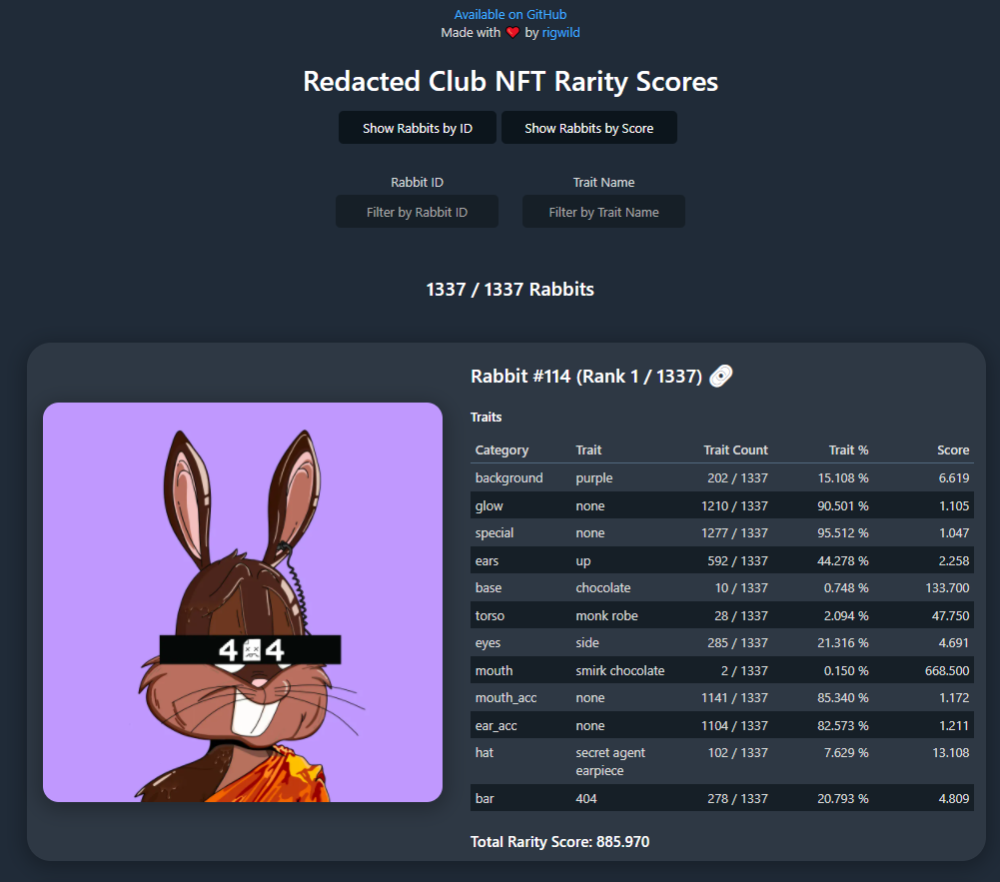

# Anons S2 NFT Rarity Scores

This repository will list every rarity score for each Anons S2 "The Army" NFTs from https://anons.army/ on [Secret Network](https://scrt.network/).

The rarity score is calculed following [these formulas (`Rarity Score: How is it Calculated?` section)](https://raritytools.medium.com/ranking-rarity-understanding-rarity-calculation-methods-86ceaeb9b98c#2942).

A rarity score can be calculated in a lot of different ways with each their specifics strengths and flaws. **This is not an official ranking.**

Any traits that is set to `None` is treated as any other trait. An NFT with all traits to `None` would then be very rare. **It counts in scores**.

## Raw Rarity Scores

- Human-readable version: [`_output_results.log`](./_output_results.log)
- JSON:
  - [`_output_elementsNullTraitsAsNone.json`](./_output_elementsNullTraitsAsNone.json): Elements with `null` traits set to `none`
  - [`_output_rarity.json`](./_output_rarity.json): Rarity scores
  - [`_output_elementsWithRarity.json`](./_output_elementsWithRarity.json): Elements with its rarity

## Reproduce calculations

```sh
pnpm install
pnpm build
pnpm extractTraits
pnpm exportScores
```

If the generated [`_output_elementsWithRarity.json`](./_output_elementsWithRarity.json) file has not changed, you are sure I did not cheat by manually editing it!

SHA256 hashes:

```
$ sha256sum _*
TODO: Add hashes when minted out
```

## Fetch input data

To calculate from zero, download the input data directly from the API.

```sh
rm _input_*
rm _output_*
curl -o _input_elements.json https://rest-api.anons.army/api/anons/s2
```

**Note:** Your hashes may be different if you just updated the data, as some nft were probably revealed since my hashes were produced.

## Website

A website is available at https://anons2.rigwild.dev/



## License

[The MIT License](./LICENSE)
