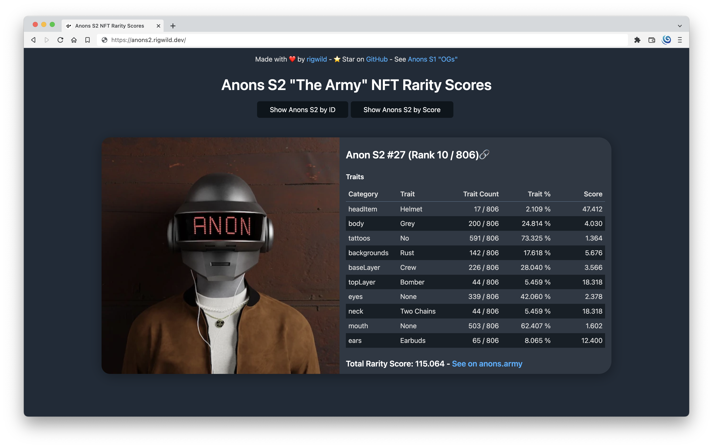

# Anons S2 NFT Rarity Scores

This project contains some rarity scores for each Anons S2 "The Army" NFTs from [anons.army](https://anons.army/) on [Secret Network](https://scrt.network/).

Anons S1 "OGs" NFTs rarity scores: [rigwild/anons-secret-nft](https://github.com/rigwild/anons-secret-nft).

The rarity score is calculed following [these formulas (`Rarity Score: How is it Calculated?` section)](https://raritytools.medium.com/ranking-rarity-understanding-rarity-calculation-methods-86ceaeb9b98c#2942). A rarity score can be calculated in a lot of different ways with each their specific strengths and flaws. **This is not an official ranking.**

Any traits that is set to `None` is treated as any other trait. An NFT with all traits to `None` would then be very rare. **It counts in the scores**.

⭐ Star the project! ⭐

## Website

A website is available at https://anons2.rigwild.dev/



## Raw Rarity Scores

- Human-readable version: [`_output_results.log`](./_output_results.log)
- JSON:
  - [`_output_elementsNullTraitsAsNone.json`](./_output_elementsNullTraitsAsNone.json): Elements with `null` traits set to `none`
  - [`_output_rarity.json`](./_output_rarity.json): Rarity scores
  - [`_output_elementsWithRarity.json`](./_output_elementsWithRarity.json): Elements with its rarity

## Reproduce calculations

```sh
pnpm install
pnpm build
pnpm extractTraits
pnpm exportScores
```

If the generated [`_output_elementsWithRarity.json`](./_output_elementsWithRarity.json) file has not changed, you are sure I did not cheat by manually editing it!

SHA256 hashes:

```
$ sha256sum _*
TODO: Add hashes when minted out
```

**Note:** Your hashes may be different if you just updated the data, as some nft were probably revealed since my hashes were produced.

## Update rarity scores and website

Download the latest data from the API, calculate the rarity from scratch and update the website.

```sh
sudo apt install curl jq
pnpm i -g zx @squoosh/cli
./update_website.sh
```

## Get rankings of NFTs list

```sh
pnpm build
curl https://rest-api.anons.army/api/anons/s2 | jq > _input_elements.json && pnpm extractTraits && pnpm exportScores
ANON='1300 1523 187 755 780 870'
ANON='1300,1523 187| 755 -780;870' # any format, parameters are cleaned!
zx _getRanking.mjs $ANON ; zx _getRanking.mjs $ANON | clipboard

Output (+ copied to clipboard):

   187: Ranked   98 of 592 - score  77.08995339
   755: Ranked  265 of 592 - score  62.45316002
   780: Ranked  186 of 592 - score  67.95338584
   870: Ranked  435 of 592 - score  50.10635172
  1300: Ranked  493 of 592 - score  45.18967711
  1523: Ranked   77 of 592 - score  80.58123589

⭐ Star https://github.com/rigwild/anons-s2-secret-nft
```

## Reuse this project for your NFT collection

This project is open source. You can reuse it for your project! ✌

The only requirements are:

- Mention my pseudo in your license
- Mention in your README that this was initially built by me, with a link to this repo.
- Mention in your website that this was initially built by me, with a link to this repo.

The code is as generic as possible, you only need to import your data in `_input_elements.json` (with the same format), edit [`./types.ts`](./types.ts) with your traits and change some texts in the website.

You may need to edit stuff if your NFTs collection doesn't have a "reveal" feature (`element.revealed: 1`).

### Deploy

Run with Node.js 16. To do this on [Cloudflare Pages](https://pages.cloudflare.com/), set the `NODE_ENV` environment variable to `16` (see [Language support and tools](https://developers.cloudflare.com/pages/platform/build-configuration/#language-support-and-tools)).

Build command: `cd vite-project && npm install -D && npm run build`

Build output directory: `/vite-project/dist`

## License

[The MIT License](./LICENSE)
